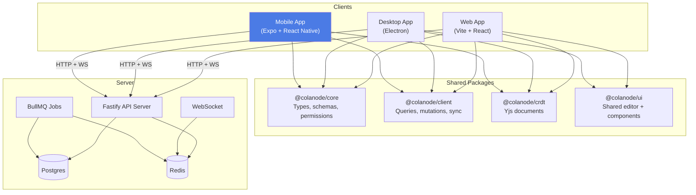
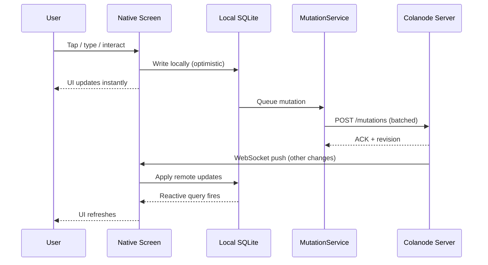
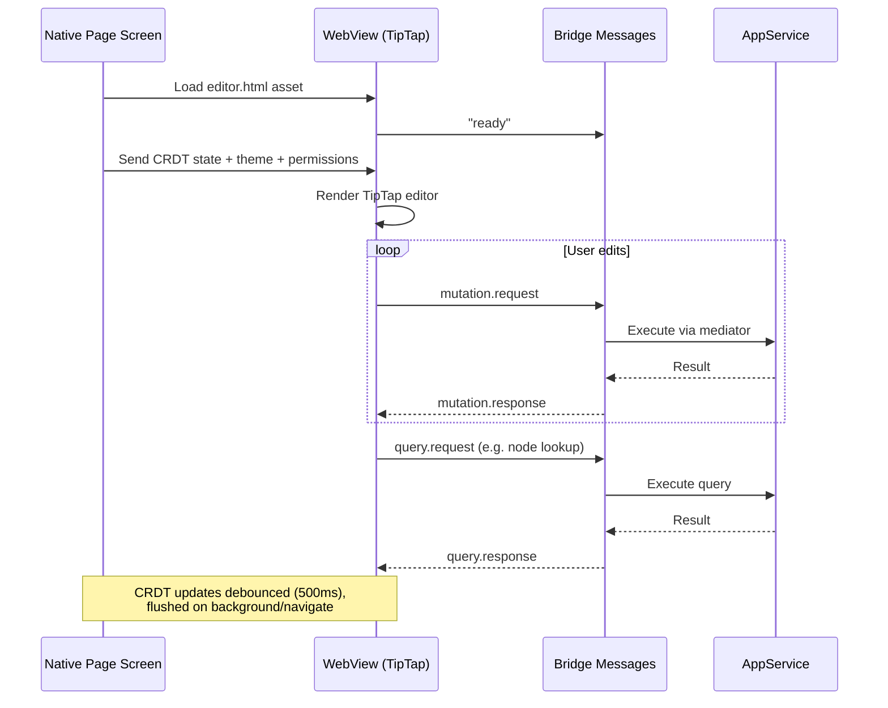

# Colanode Mobile

> **Status:** Experimental and not production-ready.
> The mobile app exists to help the team iterate on Colanode's native experience, validate product decisions, and share as much logic as possible with the web and desktop clients.

## Overview

Colanode Mobile is an Expo + React Native client for Colanode's local-first collaboration platform. It reuses the same shared data model and sync stack as the other apps:

- `@colanode/client` for local database access, queries, mutations, and sync
- `@colanode/core` for schemas, types, permissions, and business rules
- `@colanode/crdt` for Yjs-backed collaborative documents
- `@colanode/ui` for shared editor behavior and UI building blocks where it makes sense

The app is mostly native React Native UI. The main exception is page editing: the rich-text editor runs as a small browser app inside a `WebView`, while the surrounding shell, routing, data access, and native integrations stay in React Native.

## Architecture



### How data flows on mobile



### How the embedded page editor works



## What Exists Today

- **Authentication:** server selection, OTP login, registration, password reset
- **Messaging:** chat and channel browsing, message sending, replies, reactions, editing, deletion
- **Content:** spaces, folders, files, pages, and workspace navigation
- **Page editing:** inline rich-text editing via embedded TipTap WebView (paragraph, headings, lists, tasks, blockquotes, horizontal rules)
- **File management:** file picking, upload (resumable via tus-js-client), download, and preview
- **Workspaces:** workspace switching, creation, and basic settings
- **Members:** member list, invite flow with email chips and role picker
- **Offline support:** reads from local SQLite cache, offline-aware UI with network banner
- **Unread tracking:** unread dots on chat list items, unread summary on home screen
- **Theming:** dark and light mode with system preference detection

## Getting Started

### Prerequisites

- Node.js (see the repository root for the expected version)
- npm
- Xcode for iOS Simulator and/or Android Studio for Android Emulator
- A running Colanode server

### Install dependencies

From the repository root:

```bash
npm install
```

### Run the mobile app

```bash
cd apps/mobile
npm run ios       # iOS Simulator
npm run android   # Android Emulator
npm run start     # Expo dev server only
```

The `prestart`, `preios`, and `preandroid` scripts build and copy the embedded page editor asset before Expo starts.

## Project Structure

```text
apps/mobile/
├── app/                               # Expo Router file-based routes
│   ├── _layout.tsx                    # Root: AppService init, QueryClient, SplashScreen
│   ├── (auth)/                        # Auth screens
│   │   ├── index.tsx                  #   Server selection
│   │   ├── login.tsx                  #   Email/password + OTP login
│   │   ├── register.tsx               #   Registration
│   │   ├── reset.tsx                  #   Password reset
│   │   ├── server-add.tsx             #   Add custom server
│   │   └── create-workspace.tsx       #   First workspace creation
│   └── (app)/                         # Main app (tabs)
│       ├── _layout.tsx                # Tab navigator + WorkspaceContext
│       ├── (home)/index.tsx           # Unread summary, recent chats, quick actions
│       ├── (chats)/                   # Chat tab
│       │   ├── index.tsx              #   Chat list
│       │   ├── [chatId].tsx           #   Conversation view
│       │   └── new-chat.tsx           #   Create chat
│       ├── (spaces)/                  # Spaces tab
│       │   ├── index.tsx              #   Space list
│       │   ├── create-space.tsx       #   Create space form
│       │   ├── space/[spaceId].tsx    #   Space children browser
│       │   ├── channel/[channelId].tsx#   Channel messages
│       │   ├── page/[pageId]/         #   Page viewer/editor (WebView)
│       │   ├── file/[fileId].tsx      #   File preview/download
│       │   └── folder/[folderId].tsx  #   Folder contents
│       └── (settings)/                # Settings tab
│           ├── index.tsx              #   Settings home
│           ├── account.tsx            #   Account + avatar upload
│           ├── workspace.tsx          #   Workspace settings
│           ├── members.tsx            #   Member list
│           ├── invite.tsx             #   Invite members
│           ├── create-workspace.tsx   #   Create workspace
│           └── about.tsx              #   App info
├── src/
│   ├── components/
│   │   ├── ui/                        # Reusable: buttons, inputs, sheets, banners
│   │   ├── messages/                  # Message list, items, input, reactions, actions
│   │   ├── nodes/                     # Node icons, child lists, create/rename/action sheets
│   │   ├── pages/                     # WebView wrapper, editor toolbar, block type sheet
│   │   ├── auth/                      # Login, register, verify, reset forms
│   │   ├── avatars/                   # Avatar display + picker
│   │   ├── emojis/                    # Emoji picker (categories + search)
│   │   ├── chats/                     # Chat list items with unread badges
│   │   ├── spaces/                    # Space list items
│   │   ├── files/                     # File list items
│   │   ├── workspaces/                # Workspace switcher, create form
│   │   └── conversation/              # Shared conversation screen
│   ├── contexts/                      # App service, workspace, theme, switcher
│   ├── hooks/                         # useLiveQuery, useQuery, useMutation, useNodeRole, etc.
│   ├── services/                      # Expo implementations: filesystem, SQLite, paths
│   ├── lib/                           # Crypto polyfill, colors, query client, utils
│   └── mocks/                         # Metro mocks for browser-only modules
├── webviews/
│   └── editor/                        # Embedded TipTap editor (separate Vite build)
│       ├── src/                       # Editor app: bridge, extensions, views
│       ├── vite.config.ts             # Builds to single HTML file
│       └── editor.html                # Entry HTML
├── assets/
│   └── editor-dist/editor.html        # Built editor asset (copied by pre-scripts)
├── scripts/copy-editor.js             # Builds + copies editor before Expo starts
├── index.js                           # Entry: crypto polyfill → expo-router
├── app.json                           # Expo config (iOS + Android)
├── eas.json                           # EAS Build profiles
├── metro.config.js                    # Asset extensions, module mocks
└── tsconfig.json                      # TypeScript config with package aliases
```

## Key Layers

### 1. Native mobile shell

The Expo / React Native app handles everything except the rich-text editor DOM:

- File-based routing via Expo Router with `(auth)` and `(app)` route groups
- Tab navigation: Home, Spaces, Chats, Settings
- Native screens and components for all UI
- Expo-backed services for filesystem, SQLite, camera/media, clipboard, and network detection
- TanStack Query for data fetching with event bus integration

### 2. Shared local-first data layer

The mobile app follows the same local-first model as the desktop and web clients:

1. **Reads** come from the local SQLite cache (instant).
2. **Writes** are applied locally first (optimistic).
3. **Mutations** sync to the server in batches via HTTP.
4. **CRDT updates** merge concurrent document edits via Yjs.
5. **WebSocket synchronizers** keep local state fresh with cursor-based streaming.

This is why mobile can reuse `@colanode/client`, `@colanode/core`, and `@colanode/crdt` instead of reimplementing business logic.

### 3. Embedded page editor

Rich-text page editing is implemented as an embedded browser app loaded into a React Native `WebView`.

Why:

- The shared editor stack (TipTap / ProseMirror) depends on DOM APIs
- React Native cannot run DOM-based editor code directly
- A WebView gives the app a browser runtime inside the native screen
- This lets mobile reuse the mature shared web editor instead of maintaining a second implementation

The editor lives in `webviews/editor/`, has its own Vite build, and produces a single HTML file that Metro bundles as an asset. The native `PageWebView` component loads it and communicates via a bidirectional message bridge.

## Metro Configuration

`metro.config.js` is customized for mobile-specific needs:

- **Asset extensions:** `.db` (emoji/icon databases) and `.html` (embedded editor)
- **Empty mocks:** `@tiptap/core`, `@tiptap/pm` (DOM-dependent, pulled in via barrel exports but not used at runtime)
- **Custom mocks:** `isomorphic-webcrypto` (delegates to native `globalThis.crypto`)
- **Blocked patterns:** `kysely/dist/*file-migration-provider` (webpack-specific, incompatible with Hermes)

The custom `index.js` entry point loads `crypto-polyfill.ts` before anything else, ensuring `crypto.getRandomValues` is available when `ulid` and Yjs modules initialize.

## Working On The Embedded Editor

Browser-side editor code lives in `webviews/editor/src/`. Native hosting and bridge code lives in `src/components/pages/page-webview.tsx`. The native page screen is at `app/(app)/(spaces)/page/[pageId]/index.tsx`.

```bash
# Rebuild the editor after changes
cd apps/mobile/webviews/editor
npm run build

# Run the app (pre-scripts rebuild automatically)
cd apps/mobile
npm run ios
```

The bridge protocol supports:

| Direction | Messages |
|---|---|
| Native → WebView | `init`, `state.update`, `theme.change`, `permission.change`, `flush`, `block.command`, keyboard events |
| WebView → Native | `ready`, `mutation.request`, `query.request`, `navigate.node`, `navigate.url`, `editor.focus`, `error` |

## Dependencies

| Category | Key packages |
|---|---|
| Framework | `expo` ~54, `react` 19.1, `react-native` 0.81 |
| Routing | `expo-router` ~6 |
| State | `@tanstack/react-query` ^5 |
| Platform APIs | `expo-file-system`, `expo-sqlite`, `expo-crypto`, `expo-image-picker`, `expo-document-picker`, `expo-clipboard` |
| Network | `@react-native-community/netinfo` |
| WebView | `react-native-webview` ^13 |
| UI | `react-native-svg`, `react-native-screens`, `react-native-safe-area-context` |

## Notes And Tradeoffs

- The app is still evolving quickly, so some flows are intentionally incomplete.
- The page title is managed by the native screen header, while the document body is managed by the embedded editor.
- Using a WebView for the editor adds build/bridge complexity, but lets the app reuse the mature shared web editor stack instead of maintaining a second rich-text editor in pure React Native.
- No inline mark editing (bold/italic) in the editor yet — plain text formatting per block only.
- No database views on mobile (complex, poor mobile UX).
- No push notifications yet.
